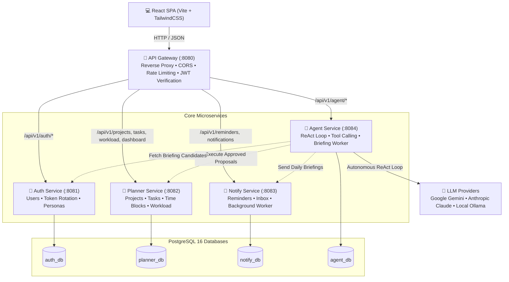

# Planly 🗓️ 🤖

> **Planly** is an intelligent, microservices-driven daily planner and calendar system featuring **human-in-the-loop autonomous AI assistance**, workload balancing, multi-persona daily briefings, and strict multi-tenant isolation.

---

## 🏗️ Architecture Overview

Planly is built with a resilient microservices architecture in Go and React, enforcing complete database isolation (database-per-service pattern), parameterized SQL queries via `sqlc`, and a unified API Gateway.



---

## 🛠️ Technology Stack

| Domain | Technologies |
|---|---|
| **Backend Services** | Go 1.24+, Chi router, `sqlc`, `pgx/v5` connection pool, `golang-jwt` |
| **Databases** | PostgreSQL 16 (4 isolated databases: `auth_db`, `planner_db`, `notify_db`, `agent_db`) |
| **API Gateway** | Go reverse proxy, token bucket rate limiter (`golang.org/x/time/rate`), CORS middleware |
| **Frontend** | React 19, TypeScript, Vite, TailwindCSS v4, TanStack Query v5, FullCalendar, Lucide Icons, Recharts |
| **AI / LLM Integration** | Google Gemini (`gemini-3.5-flash-lite`), Anthropic Claude, Local Ollama |
| **DevOps & Testing** | Docker Compose, GitHub Actions CI, Vitest, Testing Library, pgx test suite |

---

## 🔒 Security & Strict Multi-Tenant Isolation

1. **Database-Per-Service Isolation**: Each service connects exclusively to its own database schema. No cross-database joins exist.
2. **User Scope Enforcement**: Every single database query filters by `user_id` parsed from the validated JWT token (`sub` claim). Requests never trust user IDs from payloads or query params.
3. **Automated Isolation Sweep (Step 8.1)**: Comprehensive automated test suites (`services/planner/internal/handler/isolation_test.go`, `services/agent/internal/handler/isolation_test.go`, `services/notify/internal/handler/notify_test.go`) systematically verify that User B receives `404 Not Found` for any attempt to view, modify, or delete User A's projects, tasks, subtasks, time blocks, proposals, conversations, or notifications.

---

## 🤖 Human-in-the-Loop Proposal Engine

Planly implements safe, deterministic autonomous agent actions:

1. **Read Tools Execute Immediately**: Tools like `list_tasks`, `get_task`, `list_projects`, `list_time_blocks`, and `get_workload` run synchronously during the agent loop to gather context.
2. **Write Tools Stage Proposals**: Mutating actions (`create_task`, `update_task`, `delete_task`, `create_time_block`, `reschedule_tasks`) **never** alter planner data directly during the chat turn. Instead, they insert a staged proposal row into `agent_db.proposals`.
3. **Visual Review & Confirmation**: The user interface renders an interactive Proposal Card showing exact diffs (e.g. title changes, new dates, priority shifts).
4. **Controlled Execution**: Only when the user clicks **Approve** does the agent service invoke planner endpoints with the user's authenticated bearer token.

---

## 🧪 Agent Evaluation Benchmark (Step 8.2)

The agent evaluation test suite located in `services/agent/evals/evals_test.go` exercises end-to-end multi-turn workflows, tool schema validation, guardrail safety, and rate limiting:

| ID | Category | Scenario Description | Result |
|---|---|---|:---:|
| `EVAL-01` | Task Staging | Simple task creation proposal extraction | **PASS** |
| `EVAL-02` | Task Staging | High-priority task with RFC3339 due date & estimate | **PASS** |
| `EVAL-03` | Task Staging | Task creation linked to specified project UUID | **PASS** |
| `EVAL-04` | Goal Breakdown | Breaking down high-level goal into multi-step staged tasks | **PASS** |
| `EVAL-05` | Calendar Staging | Time block proposal with valid calendar interval | **PASS** |
| `EVAL-06` | Rescheduling | Batch rescheduling proposal for overdue tasks | **PASS** |
| `EVAL-07` | Task Staging | Task update proposal for status and priority changes | **PASS** |
| `EVAL-08` | Task Staging | Task deletion proposal staging (planner untouched) | **PASS** |
| `EVAL-09` | Read Operations | Filtered `list_tasks` inquiry execution | **PASS** |
| `EVAL-10` | Read Operations | `get_task` detail query including subtasks & tags | **PASS** |
| `EVAL-11` | Read Operations | `get_workload` query comparing planned time vs capacity | **PASS** |
| `EVAL-12` | Read Operations | `list_projects` inquiry execution | **PASS** |
| `EVAL-13` | Read Operations | `list_time_blocks` calendar query execution | **PASS** |
| `EVAL-14` | Guardrails | Rejection of malformed task UUID | **PASS** |
| `EVAL-15` | Guardrails | Rejection of inverted time block interval (`ends_at < starts_at`) | **PASS** |
| `EVAL-16` | Guardrails | Rejection of empty title during task creation | **PASS** |
| `EVAL-17` | Guardrails | Rejection of empty reschedule request array | **PASS** |
| `EVAL-18` | General | Direct text response without triggering unnecessary tool calls | **PASS** |
| `EVAL-19` | Multi-Step Loop | Multi-turn sequence: read existing tasks -> stage follow-up task | **PASS** |
| `EVAL-20` | Rate Limiting | Enforcement of daily per-user message cap (HTTP 429) | **PASS** |

### **Evaluation Benchmark Pass Rate: 20 / 20 (100.0%)**

---

## 🚀 Getting Started

### Prerequisites
- Docker & Docker Compose
- Node.js 20+ (for local frontend development)
- Go 1.24+ (for local backend development)

### 1. Environment Setup
Copy the example environment file:
```bash
cp .env.example .env
```
Ensure you provide a valid LLM API key in `.env` (Google Gemini or Anthropic Claude) or run with local Ollama:
```env
LLM_PROVIDER=gemini
GEMINI_API_KEY=your_gemini_api_key
GEMINI_MODEL=gemini-3.5-flash-lite
```

### 2. Start Services via Docker Compose
```bash
docker compose up -d --build
```
This starts:
- `planly-postgres` on `:5432` (auto-initializes all 4 databases)
- `planly-auth-svc` on `:8081`
- `planly-planner-svc` on `:8082`
- `planly-notify-svc` on `:8083`
- `planly-agent-svc` on `:8084`
- `planly-gateway` on `:8080` (public ingress)

### 3. Start Frontend Development Server
```bash
cd web
npm install
npm run dev
```
Open [http://localhost:5173](http://localhost:5173) in your browser.

### 4. Seed Demo Data (Step 8.6)
Populate the database with pre-configured personas (`student`, `undergraduate`, `employee`):
```bash
bash scripts/seed.sh
```

Demo Credentials:
- **Student**: `student@planly.dev` / `Password123!`
- **Undergraduate**: `undergrad@planly.dev` / `Password123!`
- **Employee**: `employee@planly.dev` / `Password123!`

---

## 🔍 Observability & Logging

- Every HTTP request passing through the Gateway is tagged with a unique `X-Request-ID` header.
- The `X-Request-ID` is propagated across downstream microservices and attached to all structured JSON `slog` logs.
- Agent runs log structured latency and token telemetry:
  ```json
  {"time":"2026-10-07T12:52:37Z","level":"INFO","msg":"agent run completed","run_id":"...","user_id":"...","trigger":"chat","iterations":2,"duration_ms":1420,"input_tokens":520,"output_tokens":85,"staged_proposals":1}
  ```

---

## 📖 API Documentation

A complete OpenAPI 3.0 specification is available at [docs/openapi.yaml](file:///Users/kavith_rashintha/Documents/Working%20Stuff/Personal%20Work/Projects/Project%202%20-%20Plannly/Planly/docs/openapi.yaml). You can view it using any OpenAPI viewer (Swagger UI, Redoc, or Postman).

---

## ⚠️ Known Limitations & Future Work

1. **Third-Party Calendar Sync**: External Google Calendar and Microsoft Outlook two-way sync is planned for future phases.
2. **Team Collaboration**: Currently optimized for single-user productivity; shared workspaces and team task delegation are part of the roadmap.
3. **Recurring Tasks**: Subtasks and time blocks support ad-hoc creation; recurring schedule rule evaluation is slated for subsequent releases.